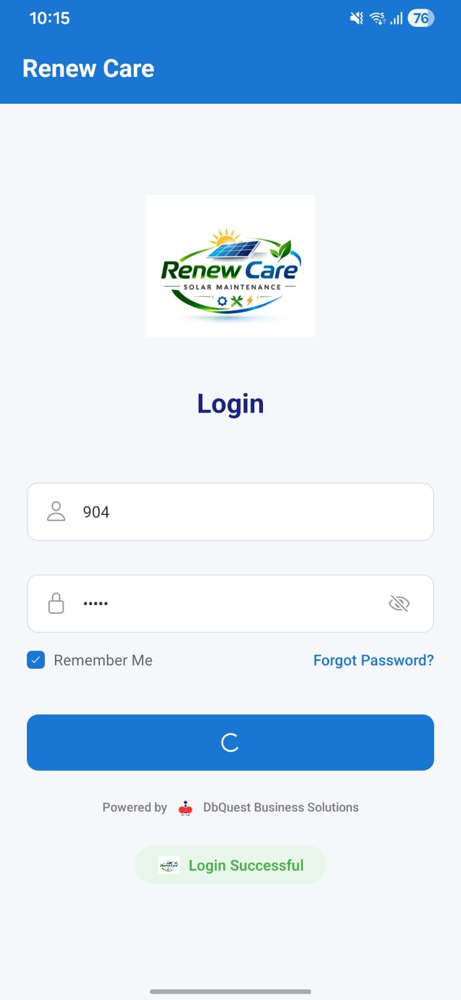

# RenewCare

## Multi-Platform Maintenance Management System

## About the Project

RenewCare is a multi-platform maintenance management system designed
to streamline industrial equipment monitoring and service operations.

The system integrates a desktop application and a React Native mobile
application through Spring Boot REST APIs, with SQL Server as the
centralized database.

## Project Objective

The objective of RenewCare is to improve maintenance operations by
providing centralized equipment management, service tracking, and
real-time maintenance updates.

The system helps reduce manual effort, improve workflow efficiency,
and enables technicians to access and update maintenance information
directly from the field.

## Technology Stack

| Category | Technology |
|----------|------------|
| Mobile Application | React Native |
| Programming Language | JavaScript |
| Desktop Application | PowerBuilder |
| Backend | Spring Boot |
| APIs | REST APIs |
| Database | SQL Server Management Studio |
| API Testing | Postman |
| Mobile Runtime | Expo Go |
| Development Tool | Visual Studio Code |

## Key Features

### Authentication

- User authentication
- Role-based access for Admin and Technician

### Plant Management

- Plant information management
- Plant and equipment association
- Plant details and status management

### Equipment Management

- Equipment information management
- Equipment tracking
- Equipment details and specifications

### Service Request Management

- Service request creation
- Service request tracking
- Technician assignment
- Equipment-related issue management

### Service Execution

- Assigned service viewing
- Maintenance activity updates
- Service status updates
- Service details recording
- Pending and completed service tracking

### Parts Management

- Spare-parts management
- Parts usage tracking
- Quantity management
- Cost management

## Screenshots

### Mobile Application

<table>
<tr>
<td align="center"><b>Login</b></td>
<td align="center"><b>Dashboard</b></td>
</tr>

<tr>
<td>

</td>
<td>

</td>
</tr>

<tr>
<td align="center"><b>Plant Management</b></td>
<td align="center"><b>Create Service</b></td>
</tr>

<tr>
<td>

</td>
<td>

</td>
</tr>

<tr>
<td align="center"><b>Service Management</b></td>
<td></td>
</tr>

<tr>
<td>

</td>
<td></td>
</tr>
</table>

### Desktop Application

<table>
<tr>
<td align="center"><b>Service Entry</b></td>
<td align="center"><b>Service Report</b></td>
</tr>

<tr>
<td>

</td>
<td>

</td>
</tr>
</table>
## System Architecture

```text
+---------------------------+
|   Desktop Application     |
|       PowerBuilder        |
+-------------+-------------+
              |
              | REST APIs
              v
+---------------------------+
|      Spring Boot          |
|        Backend            |
+-------------+-------------+
              |
              | Database Connection
              v
+---------------------------+
|       SQL Server          |
|   Centralized Database    |
+-------------+-------------+
              ^
              |
              | REST APIs
              |
+-------------+-------------+
|  React Native Mobile App  |
|         Expo Go           |
+---------------------------+
